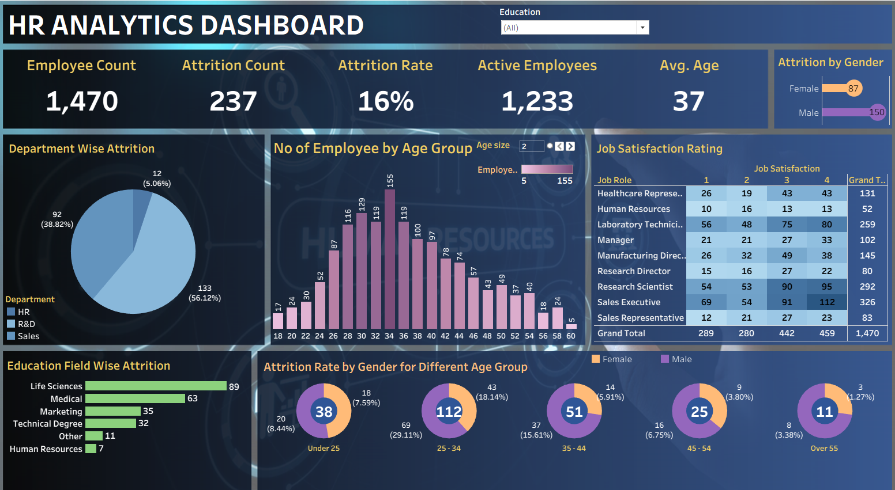

# 👨‍💼 HR Analytics Dashboard | Tableau

An interactive **HR Analytics Dashboard** developed using **Tableau** to analyze workforce trends, employee attrition, job satisfaction, and demographic insights. It enables HR professionals and business leaders to identify workforce patterns, understand employee turnover, and support strategic HR decision-making through data-driven insights.

> 👥 **1,470 Employees** · 🔻 **16% Attrition (237 left)** · ✅ **1,233 Active** · 🎂 **Avg. Age 37**

---

## 📌 Project Overview

The HR Analytics Dashboard provides a comprehensive overview of employee demographics, attrition trends, job satisfaction, and workforce distribution. It converts raw HR data into meaningful visualizations that help organizations monitor employee retention and identify the factors influencing attrition.

The dashboard focuses on key HR metrics including employee count, attrition analysis, department performance, age distribution, education background, and job satisfaction — all on a single interactive page.

---

## 📈 Dashboard Preview



---

## 📊 Dashboard Sections & Insights

### 👥 Workforce Overview (KPIs)
- **Total Employees:** 1,470 · **Active:** 1,233 · **Attrition:** 237
- **Attrition Rate:** 16% · **Average Age:** 37 years

### 🚻 Attrition by Gender
- **Male attrition: 150** vs **Female attrition: 87** — men show notably higher turnover

### 🏢 Department-wise Attrition
- **Sales: 133 (56.12%)** — the highest by far
- **R&D: 92 (38.82%)**
- **HR: 12 (5.06%)**

### 🎂 Employees by Age Group
- Workforce peaks around **age 34 (155 employees)**, tapering off after 45
- Confirms a predominantly young-to-mid-career workforce

### ⭐ Job Satisfaction Rating (by Job Role, 1–4)
- **Sales Executive** has the largest headcount (**326**), then **Research Scientist (292)** and **Laboratory Technician (259)**
- Rating **4 (highest satisfaction) has the most responses — 459 employees**

### 🎓 Education Field-wise Attrition
- **Life Sciences (89)** and **Medical (63)** account for the most attrition
- Followed by Marketing (35), Technical Degree (32), Other (11), Human Resources (7)

### 👨‍👩‍👧 Attrition by Gender Across Age Groups
- **25–34 is the highest-risk group: 112 attritions (29.11%)**
- Then Under 25 (38), 35–44 (51), 45–54 (25), Over 55 (11)

---

## 🛠️ Tools & Technologies

- Tableau (Tableau Public / Desktop)
- Data Source Connections & Joins
- Calculated Fields
- Data Modeling
- Interactive Dashboards & Filters

---

## 📊 Features

Interactive dashboard · Dynamic education filter · KPI cards · Pie & donut charts · Bar charts · Highlight/matrix tables · Cross filtering · HR analytics & BI reporting

---

## 📁 Repository Structure

```
HR-Analytics-Dashboard/
│
├── README.md
├── LICENSE
├── Dashboard/
│   └── HR Analytics Dashboard.twbx  # Tableau packaged workbook
├── Dataset/
│   └── HR_Analytics_Data.xlsx      # Source dataset
├── Images/
│   └── dashboard.png               # Dashboard screenshot
└── docs/
    └── Dashboard_Overview.pdf       # Dashboard exported to PDF
```

---

## 📌 Business Questions Answered

- What is the total employee count and how many are currently active?
- What is the organization's attrition count and rate?
- What is the average employee age?
- Which gender experiences higher attrition?
- Which department has the highest employee turnover?
- Which age group has the largest workforce, and which is most at risk of attrition?
- How satisfied are employees across different job roles?
- Which educational field has the highest attrition?

---

## 📈 Key Dashboard KPIs

Total Employees · Active Employees · Attrition Count · Attrition Rate · Average Employee Age · Gender-wise Attrition · Department-wise Attrition · Employee Age Distribution · Job Satisfaction Ratings · Education Field Attrition

---

## 💡 Key Insights

- **16% overall attrition** — 237 of 1,470 employees have left.
- **Sales** is the biggest source of attrition (56% of all exits).
- **Male employees** leave at a higher rate than female employees.
- The **25–34 age group** is the most attrition-prone segment (112 exits).
- **Life Sciences** graduates account for the most attrition by education field.
- Most employees rate their job satisfaction at the **highest level (4)**.

---

## 🚀 Future Improvements

- Predictive attrition analysis using Machine Learning
- Employee performance dashboard
- Hiring & recruitment analytics
- Salary & compensation analysis
- Diversity & inclusion dashboard
- Leave & attendance analytics
- HR forecasting & trend analysis

---

## 👨‍💻 Author

**Tejus Pandey**

- 💼 LinkedIn: https://www.linkedin.com/in/tejuspandey
- 🐙 GitHub: https://github.com/tejus23

---

## ⭐ If you found this project useful, consider giving it a star!
